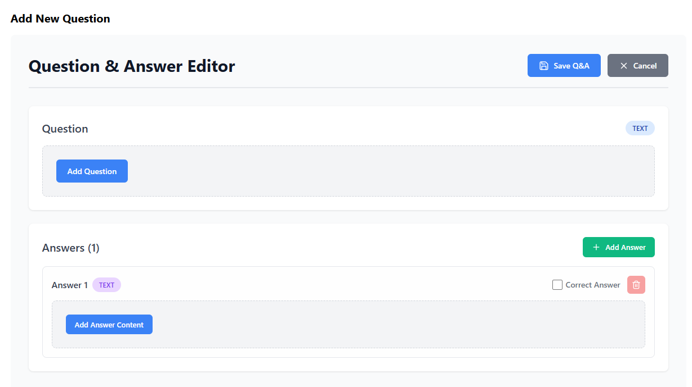

# React QA Component

A comprehensive, reusable React component package for creating and displaying Question & Answer content with multimedia support including text, markdown, audio, and video.

## Features

- 📝 **Multiple Content Types**: Support for plain text, Markdown, audio, and video
- ✏️ **QAEditor**: Create questions with multiple answers
- 📺 **QAPlayer**: Display Q&A content with collapsible answers
- 🎤 **Audio Recording**: Built-in audio recorder with preview
- 📹 **Video Recording**: Built-in video recorder with preview
- 📄 **Markdown Support**: Rich text editing with preview
- 🎨 **Styled Components**: Beautiful, responsive UI out of the box
- ♿ **Accessible**: Keyboard navigation and screen reader friendly

## Installation

```bash
npm install reactjs-qa-component
```

or

```bash
yarn add reactjs-qa-component
```

## Peer Dependencies

This package requires:
- `react` ^18.0.0
- `react-dom` ^18.0.0

## Usage

### Basic Example

```javascript
import React, { useState } from 'react';
import { QAEditor, QAPlayer } from 'reactjs-qa-component';

function App() {
  const [qaData, setQaData] = useState(null);
  const [showEditor, setShowEditor] = useState(true);

  const handleSave = (data) => {
    console.log('Q&A Data:', data);
    setQaData(data);
    setShowEditor(false);
  };

  return (
    <div>
      {showEditor ? (
        <QAEditor 
          onSave={handleSave} 
          onCancel={() => console.log('Cancelled')} 
        />
      ) : (
        <QAPlayer 
          qaData={qaData} 
          showAnswersInitially={false}
          title="My Question & Answer"
        />
      )}
    </div>
  );
}

export default App;
```

### QAEditor API

The `QAEditor` component allows users to create questions with multiple answers.

#### Props

| Prop | Type | Required | Description |
|------|------|----------|-------------|
| `onSave` | `function` | Yes | Callback function called when Q&A is saved. Receives the Q&A data object |
| `onCancel` | `function` | No | Callback function called when user cancels editing |
| `initialData` | `object` | No | Pre-populate editor with existing Q&A data |

#### Data Structure

The `onSave` callback receives an object with the following structure:

```javascript
{
  question: {
    type: 'TEXT' | 'MARKDOWN' | 'AUDIO' | 'VIDEO',
    content: 'string content for TEXT/MARKDOWN',
    file: File // for AUDIO/VIDEO
  },
  answers: [
    {
      id: 1,
      type: 'TEXT' | 'MARKDOWN' | 'AUDIO' | 'VIDEO',
      content: 'string content for TEXT/MARKDOWN',
      file: File // for AUDIO/VIDEO
    },
    // ... more answers
  ]
}
```

### QAPlayer API

The `QAPlayer` component displays Q&A content with multimedia support.

#### Props

| Prop | Type | Required | Description |
|------|------|----------|-------------|
| `qaData` | `object` | Yes | Q&A data object (structure shown above) |
| `showAnswersInitially` | `boolean` | No | Whether to show answers on load (default: `false`) |
| `title` | `string` | No | Optional title displayed above the Q&A |

#### Data Structure for Display

For displaying existing Q&A content (e.g., from a database), use this structure:

```javascript
{
  question: {
    type: 'TEXT',
    content: 'What is React?',
    mediaUrl: 'https://example.com/media.mp3' // for AUDIO/VIDEO from server
  },
  answers: [
    {
      id: 1,
      type: 'TEXT',
      content: 'React is a JavaScript library...'
    },
    {
      id: 2,
      type: 'MARKDOWN',
      content: '## React Features\n- Component-based\n- Virtual DOM'
    },
    {
      id: 3,
      type: 'AUDIO',
      mediaUrl: 'https://example.com/answer-audio.mp3'
    }
  ]
}
```

## Content Types

### TEXT
Plain text content with line breaks preserved.

```javascript
{
  type: 'TEXT',
  content: 'This is plain text content\nWith line breaks'
}
```

### MARKDOWN
Rich text with markdown formatting support.

```javascript
{
  type: 'MARKDOWN',
  content: '# Heading\n\n**Bold text** and *italic text*\n\n[Link](https://example.com)'
}
```

### AUDIO
Audio recording or file.

```javascript
// When creating (editor)
{
  type: 'AUDIO',
  file: File // Audio file object
}

// When displaying (player)
{
  type: 'AUDIO',
  mediaUrl: 'https://example.com/audio.mp3' // URL to audio file
}
```

### VIDEO
Video recording or file.

```javascript
// When creating (editor)
{
  type: 'VIDEO',
  file: File // Video file object
}

// When displaying (player)
{
  type: 'VIDEO',
  mediaUrl: 'https://example.com/video.mp4' // URL to video file
}
```

## Advanced Examples

### Pre-populate Editor with Existing Data

```javascript
const existingData = {
  question: {
    type: 'TEXT',
    content: 'What is the capital of France?'
  },
  answers: [
    {
      id: 1,
      type: 'TEXT',
      content: 'Paris'
    },
    {
      id: 2,
      type: 'MARKDOWN',
      content: '**Paris** is the capital of France.'
    }
  ]
};

<QAEditor 
  initialData={existingData}
  onSave={handleSave}
  onCancel={handleCancel}
/>
```

### Display Q&A with Answers Initially Visible

```javascript
<QAPlayer 
  qaData={qaData}
  showAnswersInitially={true}
  title="Frequently Asked Question"
/>
```

### Handling File Uploads

When using audio or video content, you'll need to upload the files to your server:

```javascript
const handleSave = async (data) => {
  // Upload question file if it exists
  if (data.question.file) {
    const formData = new FormData();
    formData.append('file', data.question.file);
    
    const response = await fetch('/api/upload', {
      method: 'POST',
      body: formData
    });
    
    const { url } = await response.json();
    data.question.mediaUrl = url;
    delete data.question.file;
  }
  
  // Upload answer files
  for (let answer of data.answers) {
    if (answer.file) {
      const formData = new FormData();
      formData.append('file', answer.file);
      
      const response = await fetch('/api/upload', {
        method: 'POST',
        body: formData
      });
      
      const { url } = await response.json();
      answer.mediaUrl = url;
      delete answer.file;
    }
  }
  
  // Save to database
  await saveToDatabase(data);
};
```

### Integration with Backend

Example of saving and retrieving Q&A data:

```javascript
// Saving Q&A
const handleSave = async (qaData) => {
  try {
    // Upload files first (see above)
    // Then save the Q&A data
    const response = await fetch('/api/qa', {
      method: 'POST',
      headers: { 'Content-Type': 'application/json' },
      body: JSON.stringify(qaData)
    });
    
    const savedQA = await response.json();
    console.log('Saved Q&A:', savedQA);
  } catch (error) {
    console.error('Error saving Q&A:', error);
  }
};

// Loading Q&A
const loadQA = async (qaId) => {
  try {
    const response = await fetch(`/api/qa/${qaId}`);
    const qaData = await response.json();
    setQaData(qaData);
  } catch (error) {
    console.error('Error loading Q&A:', error);
  }
};
```

## Styling

The component comes with default styles, but you can override them by targeting the CSS classes:

```css
/* Override Q&A Editor styles */
.qa-editor-container {
  max-width: 1400px;
}

.qa-section-title {
  color: #your-color;
}

/* Override Q&A Player styles */
.qa-player-container {
  padding: 2rem;
}

.qa-player-question {
  border-left: 4px solid #your-color;
}
```

## Browser Support

- Chrome (latest)
- Firefox (latest)
- Safari (latest)
- Edge (latest)

**Note**: Audio and video recording requires browser support for MediaRecorder API and getUserMedia.

## Components Included

- **QAEditor**: Main editor component
- **QAPlayer**: Main player component
- **MultimediaEditor**: Internal component for content type selection
- **MultimediaPlayer**: Internal component for content display
- **MarkdownEditor**: Markdown editing with preview
- **MarkdownPlayer**: Markdown rendering
- **AudioRecorder**: Audio recording interface
- **AudioPlayer**: Audio playback
- **VideoRecorder**: Video recording interface
- **VideoPlayer**: Video playback

## TypeScript

This package is written in JavaScript but includes type definitions for TypeScript users (coming soon).

## License

MIT

## Contributing

Contributions are welcome! Please feel free to submit a Pull Request.

## Support

For issues and questions, please open an issue on GitHub.

### Screenshot

